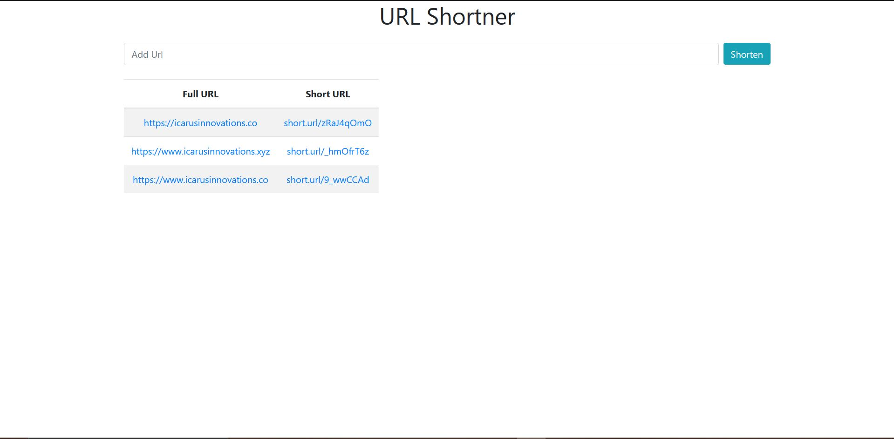

# URL-Shortner
React-TypeScript-NodeJS-Express-MySQL App that takes in a Url and gives a shortened Url

Requirements:
XAMPP Installed

### Installing steps
****
1. Download the code onto the local machine

2. Setting Up Database

```
- Run the XAMPP Apache and MySQL Services

- On browsert open http://localhost/phpmyadmin/ 

- Create a database named 'url_data'

- Import the SQL file from the repo into the database

- Create another database named 'test' (For Testing Purposes)

- Open the backend folder and go into the /db folder

- Update username and password if required

```


2. Starting Backend NodeJS Server

```
Open cmd and type following commands:

cd <Path_to_folder>

cd backend

npm run start-dev

should be running on port 5000

```

3.  Starting React-Typescript App

```
Open another cmd and type following commands:

cd <Path_to_folder>

cd frontend

npm start

```


4. The Application is also exposed as an API to get JSON Data for number of times a particular url is shortend, test the API in POSTMAN using the following link:

```
GET http://localhost:5000/api/checkUrlShortCount?url=<your_full_url>

eg. http://localhost:5000/api/checkUrlShortCount?url=https://icarusinnovations.co

JSON output: {count: 1}
```

5. Application Screenshot

